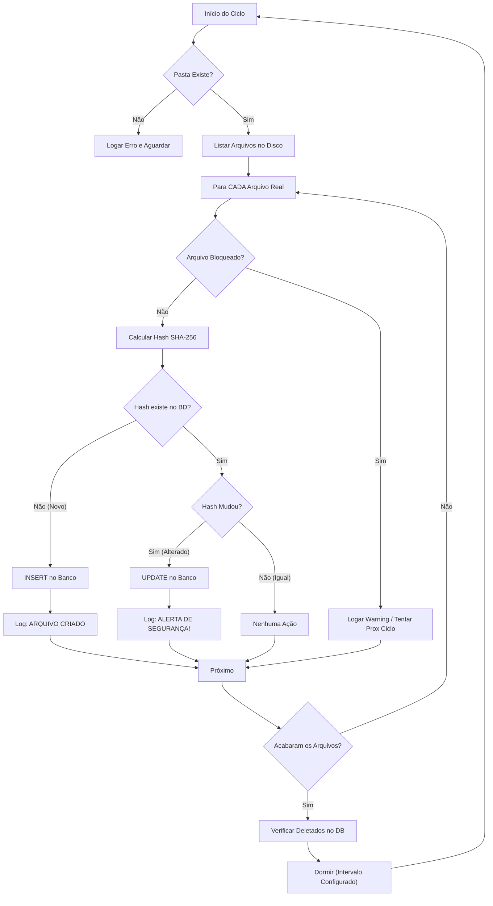

# 🛡️ IntegritySentinel (File Integrity Monitor)

> Um Worker Service robusto em .NET 8 para monitoramento de integridade de arquivos em tempo real, utilizando Hashing SHA-256 e persistência com SQLite/Dapper.


## 📋 Sobre o Projeto

O **IntegritySentinel** é um agente de segurança (FIM - File Integrity Monitor) projetado para rodar em background. Ele monitora uma pasta específica e detecta três tipos de eventos críticos de segurança:
1. **Criação** de novos arquivos.
2. **Alteração** de conteúdo (detectada via recálculo de Hash SHA-256).
3. **Exclusão** de arquivos monitorados.

O projeto foi construído seguindo princípios de **Clean Architecture**, **SOLID** e focado em performance com I/O Assíncrono.

---

## ⚙️ Arquitetura e Fluxo

O sistema opera em um ciclo de *Polling* inteligente, configurável e otimizado para ambientes onde eventos de sistema de arquivos (FileSystemWatcher) não são confiáveis (ex: Volumes Docker montados via WSL2).



## 🚀 Tecnologias Utilizadas

* **Runtime:** .NET 8 (Worker Service)
* **Banco de Dados:** SQLite (Leve e portátil)
* **ORM:** Dapper (Micro-ORM para alta performance e controle de SQL)
* **Criptografia:** SHA-256 (`System.Security.Cryptography`)
* **Logs:** Serilog (Logs estruturados e persistência em arquivo)
* **Injeção de Dependência:** Nativa do .NET
* **Configuração:** Padrão `IOptions<T>`

## 🔧 Como Rodar (Localmente)

1. Clone o repositório:
   ```bash
   git clone [https://github.com/SEU-USUARIO/IntegritySentinel.git](https://github.com/SEU-USUARIO/IntegritySentinel.git)
   ```
2. Configure o arquivo `appsettings.json` com a pasta que deseja monitorar.
3. Execute o projeto:
   ```bash
   dotnet run --project IntegritySentinel.Worker
   ```
4. Acompanhe os logs no console ou na pasta `/logs`.

---
*Desenvolvido como parte do portfólio de Segurança e Backend.*