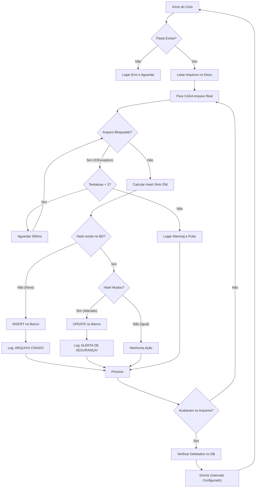

# 🛡️ IntegritySentinel (File Integrity Monitor)

> Um Worker Service robusto em .NET 8 para monitoramento de integridade de arquivos em tempo real, utilizando Hashing SHA-256 e persistência com SQLite/Dapper.


## 📋 Sobre o Projeto

O **IntegritySentinel** é um agente de segurança (FIM - File Integrity Monitor) projetado para rodar em background. Ele monitora uma pasta específica e detecta três tipos de eventos críticos de segurança:
1. **Criação** de novos arquivos.
2. **Alteração** de conteúdo (detectada via recálculo de Hash SHA-256).
3. **Exclusão** de arquivos monitorados.

O projeto foi construído seguindo princípios de **Clean Architecture**, **SOLID** e focado em performance com I/O Assíncrono e Resiliência (Retry Pattern).

---

## ⚙️ Arquitetura e Fluxo

O sistema opera em um ciclo de *Polling* inteligente. Diferente do `FileSystemWatcher` nativo (que falha em volumes Docker/WSL2), este worker implementa um algoritmo robusto que tolera falhas temporárias de leitura (arquivos em uso).



## 🚀 Tecnologias Utilizadas

* **Runtime:** .NET 8 (Worker Service)
* **Banco de Dados:** SQLite (Leve e portátil)
* **ORM:** Dapper (Micro-ORM para alta performance e controle de SQL)
* **Criptografia:** SHA-256 (`System.Security.Cryptography`)
* **Logs:** Serilog (Logs estruturados e persistência em arquivo)
* **Resiliência:** Retry Pattern nativo para I/O
* **Container:** Docker & Docker Compose

## ⚙️ Configuração

As configurações principais ficam no `appsettings.json` ou podem ser injetadas via Variáveis de Ambiente no Docker.

| Configuração | Descrição | Padrão |
|--------------|-----------|--------|
| `TargetPath` | Caminho da pasta a ser monitorada. | `monitorada` (Relativo) |
| `IntervalInSeconds` | Tempo de espera entre os ciclos de verificação. | `5` |
| `IgnoredExtensions` | Extensões que o sistema deve ignorar (ex: logs). | `.tmp|.log|.db` |

---

## 🔧 Como Rodar

### Opção 1: Via Docker (Recomendado)

Esta opção garante que o ambiente seja idêntico ao de produção, sem necessidade de instalar o .NET SDK na máquina.

1. **Configure a pasta monitorada:**
   Abra o arquivo `docker-compose.yml` e altere o volume se desejar monitorar uma pasta específica do seu host:
   ```yaml
   volumes:
     - ./caminho/da/sua/pasta:/app/monitorada
   ```

2. **Execute o container:**
   ```bash
   docker-compose up --build -d
   ```

3. **Acompanhe os logs:**
   Os logs serão salvos na pasta `./logs` ou podem ser vistos via comando:
   ```bash
   docker logs -f integrity_sentinel_app
   ```

### Opção 2: Rodando Localmente (Visual Studio / CLI)

1. Certifique-se de ter o **.NET SDK 8.0** instalado.
2. Clone o repositório.
3. Configure o `appsettings.json` com o caminho local da pasta.
4. Execute:
   ```bash
   dotnet run --project IntegritySentinel.Worker
   ```

---
*Desenvolvido como parte do portfólio de Segurança e Backend.*