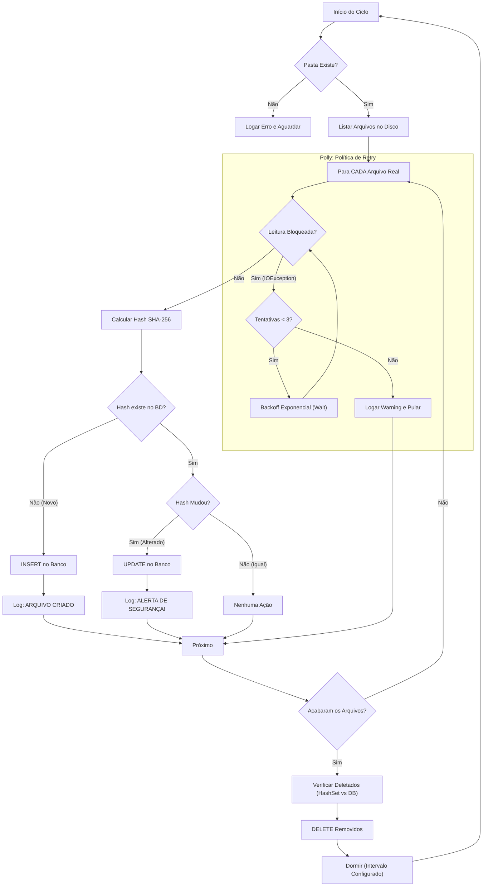

# 🛡️ IntegritySentinel (File Integrity Monitor)

> Um Worker Service robusto em .NET 8 para monitoramento de integridade de arquivos em tempo real, utilizando Hashing SHA-256, resiliência avançada e observabilidade.


## 📋 Sobre o Projeto

O **IntegritySentinel** é um agente de segurança (FIM - File Integrity Monitor) projetado para rodar em background. Ele monitora uma pasta específica e detecta três tipos de eventos críticos de segurança:
1. **Criação** de novos arquivos.
2. **Alteração** de conteúdo (detectada via recálculo de Hash SHA-256).
3. **Exclusão** de arquivos monitorados.

O projeto foi construído seguindo princípios de **Clean Architecture**, **SOLID** e focado em performance com I/O Assíncrono, Resiliência (Polly) e Qualidade (Testes Unitários).

---

## ⚙️ Arquitetura e Fluxo

O sistema opera em um ciclo de *Polling* inteligente. Utilizamos o **Polly** para garantir que arquivos bloqueados temporariamente pelo sistema operacional não gerem falsos positivos ou erros na aplicação.



## 🚀 Tecnologias Utilizadas

* **Runtime:** .NET 8 (Worker Service)
* **Banco de Dados:** SQLite (Leve e portátil)
* **ORM:** Dapper (Micro-ORM para alta performance)
* **Criptografia:** SHA-256 (`System.Security.Cryptography`)
* **Resiliência:** Polly (Retry Pattern com Backoff Exponencial)
* **Testes:** xUnit + Moq (Cobertura de testes unitários)
* **Observabilidade:** Serilog + Seq (Logs estruturados centralizados)
* **CI/CD:** GitHub Actions (Pipeline automatizado de testes)
* **Container:** Docker & Docker Compose

## 📊 Observabilidade e Monitoramento

O sistema implementa **Logs Estruturados** utilizando **Serilog**. Diferente de logs de texto simples, os eventos possuem propriedades ricas (como Nome do Arquivo, Hash, Tipo de Evento), permitindo filtragem e análise automatizada.

O projeto já vem configurado com um container **Seq** para centralização de logs.

- **Dashboard de Logs:** Acessível em `http://localhost:5341` (via Docker).
- **Alertas em Tempo Real:** O sistema categoriza eventos críticos (Deleção/Modificação) como `Warning`.

## ⚙️ Configuração

As configurações principais ficam no `appsettings.json` ou podem ser injetadas via Variáveis de Ambiente no Docker.

| Configuração | Descrição | Padrão |
|--------------|-----------|--------|
| `TargetPath` | Caminho da pasta a ser monitorada. | `monitorada` (Relativo) |
| `IntervalInSeconds` | Tempo de espera entre os ciclos de verificação. | `5` |
| `IgnoredExtensions` | Extensões que o sistema deve ignorar (ex: logs). | `.tmp|.log|.db` |

---

## 🔧 Como Rodar

### Opção 1: Via Docker (Recomendado)

Garante o ambiente completo (App + Seq) sem instalar o SDK na máquina.

1. **Execute o ambiente:**
   ```bash
   docker-compose up --build -d
   ```

2. **Acessar Logs:**
   - Painel Visual (Seq): Abra `http://localhost:5341` (Login: `admin` / Senha: ver `docker-compose.yml`).
   - Terminal: `docker logs -f integrity_sentinel_app`

### Opção 2: Rodando Localmente (Visual Studio / CLI)

1. Certifique-se de ter o **.NET SDK 8.0** instalado.
2. Execute os testes para garantir a integridade:
   ```bash
   dotnet test
   ```
3. Execute a aplicação:
   ```bash
   dotnet run --project IntegritySentinel.Worker
   ```

## 🔮 Roadmap e Melhorias Futuras

Para versões futuras (v2.0+), o projeto tem mapeado os seguintes pontos de evolução técnica, focando em escala massiva:

- [ ] **Paginação/Streaming (Batch Processing):** Implementar `IAsyncEnumerable` no repositório para processar arquivos em lotes, evitando consumo excessivo de RAM em cenários com milhões de arquivos (Otimização de Memória).
- [ ] **Hardening de Segurança:** Implementação de assinatura digital dos logs para garantir não-repúdio.
- [ ] **Notificações:** Integração com Slack/Teams/Discord via Webhooks para alertas críticos.

---
*Desenvolvido como parte do portfólio de Segurança e Backend.*